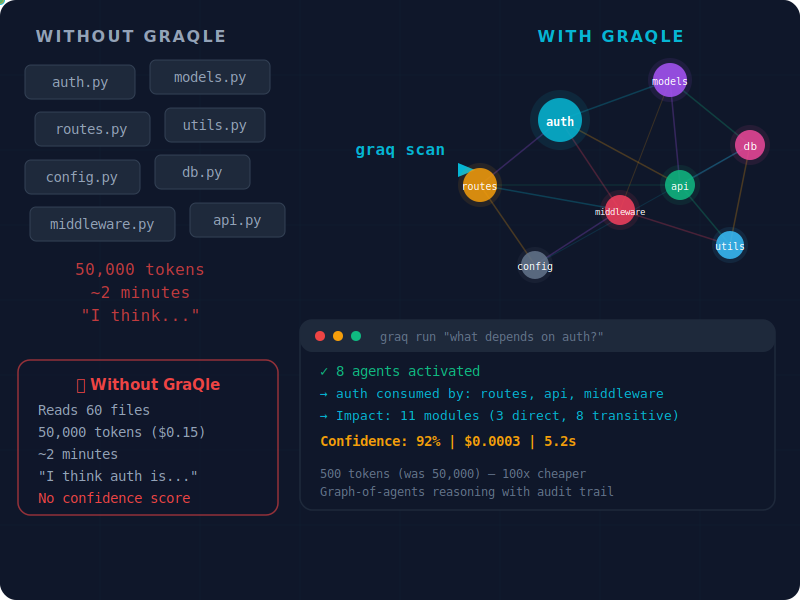

<div align="center">

<!-- HERO: The 5-second hook -->



# Your AI reads files. Gra**Q**le reads architecture.

**The context layer for AI coding agents.** Scan any codebase into a knowledge graph.
Every module becomes an agent. Ask questions — get architecture-aware answers in 5 seconds, not 2 minutes.

[](https://pypi.org/project/graqle/)
[](https://pypi.org/project/graqle/)
[](https://python.org)
[]()
[]()
[]()

```bash
pip install graqle && graq scan repo . && graq run "what's the riskiest file to change?"
```

[Website](https://graqle.com) · [Dashboard](https://graqle.com/dashboard) · [PyPI](https://pypi.org/project/graqle/) · [Changelog](CHANGELOG.md)

</div>

---

## 50,000 tokens → 500 tokens. Same answer.

| | Without GraQle | With GraQle |
|:--|:--|:--|
| **"What depends on auth?"** | AI reads 60 files, guesses | Graph traversal → exact answer in 5s |
| **Tokens per question** | 50,000 | **500** |
| **Cost per question** | ~$0.15 | **~$0.0003** |
| **Impact analysis** | Manual grep + hope | `graq impact auth.py` → full blast radius |
| **Memory across sessions** | Lost when chat resets | Persistent knowledge graph |
| **Confidence in answers** | "I think..." | **Confidence score + evidence chain** |

> *"We scanned 17,418 nodes across 3 projects in one session. Found 807 jargon blind spots,
> 218 ghost UI elements, and a CTA that was 20px tall (44px minimum). Cost: $0.30."*
> — [Quantamix Website Audit](https://graqle.com)

---

## How it works — 60 seconds

```bash
# 1. Install
pip install graqle

# 2. Scan your codebase into a knowledge graph
graq scan repo .
# → 2,847 nodes, 9,156 edges — your entire architecture mapped

# 3. Ask anything about your architecture
graq run "explain the payment flow end to end"
# → Graph-of-agents activates 8 relevant nodes, synthesizes answer
# → Confidence: 92% | Cost: $0.001 | Time: 5.2s

# 4. Connect to your AI IDE (zero config change)
graq init          # Claude Code, Cursor, VS Code, Windsurf — auto-detected
```

Your AI now has **19 architecture-aware MCP tools**. No workflow change — it uses them automatically.

---

## What makes Graqle different

<table>
<tr>
<td width="50%">

### 🔬 Graph-of-Agents Reasoning

Every module in your codebase becomes an autonomous agent. When you ask a question, only the relevant agents activate — they debate, exchange evidence, and synthesize one answer with a confidence score and full audit trail.

This is not RAG. This is **structured multi-agent reasoning over your dependency graph.**

</td>
<td width="50%">

### 🧠 The Graph Learns

```bash
graq learn "auth requires refresh token rotation"
graq grow            # Auto-runs on git commit
```

Every interaction makes the graph smarter. Lessons persist across sessions. New developers and AI tools inherit your team's institutional knowledge automatically.

</td>
</tr>
<tr>
<td>

### 🛡️ Governed AI Decisions

```bash
graq preflight "refactor the database layer"
# → 4 modules depend on connection pool
# → 2 have no tests
# → DRACE score: 0.72 (proceed with caution)
```

Every answer is auditable. DRACE governance scores across 5 dimensions. Full evidence chains. Patent-protected.

</td>
<td>

### ⚡ 14 LLM Backends

```yaml
model:
  backend: ollama    # Free, offline, air-gapped
  # Also: anthropic, openai, groq, deepseek,
  # gemini, bedrock, together, mistral,
  # fireworks, cohere, openrouter, vllm, custom
```

Use your own API keys. Run fully offline with Ollama. Smart routing assigns different models to different tasks.

</td>
</tr>
</table>

---

## Real stories from production

<details>
<summary><b>📊 "807 jargon blind spots in 90 seconds"</b> — Website audit with SCORCH</summary>

A professional website with WCAG AAA compliance still had 807 unexplained acronyms (TAMR+, TRACE, SHACL, HashGNN) that compliance officers would bounce on. GraQle's SCORCH engine found them all in one scan. Lighthouse missed every one.

**Before:** "Explore our TAMR+ SHACL-compliant governance pipeline"
**After:** "Explore our regulatory compliance pipeline" (with inline tooltips for technical terms)

</details>

<details>
<summary><b>🏗️ "17,418 nodes, 8 audits, $0.30"</b> — Multi-project knowledge graph</summary>

Three repos merged into one knowledge graph. 8 parallel audits ran across the entire surface. Found a CTA button that was only 20px tall (44px minimum for mobile touch targets). Fixed before a single prospect saw it.

**Scale:** 17,418 nodes | 70,545 edges | 8 audits | Total cost: $0.30

</details>

<details>
<summary><b>🎯 "From score 12 to production-ready in one night"</b> — Canvas workflow audit</summary>

GraQle's SCORCH engine audited a complete Canvas workflow builder. Initial score: 12/100. After one session of GraQle-guided fixes: production-ready. Zero manual testing — the graph knew which components to check and in what order.

</details>

<details>
<summary><b>🔄 "6.4 → 8.5 across 5 releases"</b> — SDK dogfooding journey</summary>

GraQle scores itself on every release. From v0.12.3 (6.4/10) to v0.29.9 (8.5/10) — every improvement was guided by the knowledge graph's own intelligence layer. 2,000+ tests. 396 compiled modules. Graph-powered development, by the graph.

</details>

---

## IDE integration — one command

```bash
graq init                    # Claude Code — auto-wires MCP tools
graq init --ide cursor       # Cursor — MCP + .cursorrules
graq init --ide vscode       # VS Code + Copilot
graq init --ide windsurf     # Windsurf — MCP + .windsurfrules
```

### 19 MCP Tools

| Tool | What it does | Free |
|:-----|:------------|:----:|
| `graq_context` | Focused 500-token context for any module | ✅ |
| `graq_reason` | Multi-agent graph reasoning | ✅ |
| `graq_impact` | Blast radius — what breaks if you change this | ✅ |
| `graq_preflight` | Pre-change safety check with risk scoring | ✅ |
| `graq_lessons` | Relevant lessons from past mistakes | ✅ |
| `graq_learn` | Teach the graph new knowledge | ✅ |
| `graq_gate` | Governance gate (pass/fail) | ✅ |
| `graq_drace` | DRACE quality score (5 dimensions) | ✅ |
| `graq_scorch_audit` | Full UX friction audit (Claude Vision) | Pro |
| `graq_scorch_behavioral` | 12 behavioral UX tests (free, no AI) | ✅ |
| +9 more | inspect, reload, route, runtime, lifecycle... | ✅ |

---

## Architecture

```
Your Code                    Knowledge Graph               AI Reasoning
┌─────────────┐             ┌──────────────────┐          ┌─────────────────┐
│ Python      │  graq scan  │  Nodes (modules) │  query   │ Graph-of-Agents │
│ TypeScript  │ ──────────> │  Edges (depends) │ ───────> │ Multi-round     │
│ Config      │             │  Skills (201)    │          │ Confidence-scored│
│ Docs        │             │  Lessons         │          │ Audit-trailed   │
└─────────────┘             └──────────────────┘          └─────────────────┘
                                    │
                              graq learn / graq grow
                                    │
                            Graph evolves with
                            every interaction
```

**Languages:** Python, JavaScript/TypeScript, React/JSX, Go, Rust, Java
**Frameworks:** FastAPI, Django, Flask, Next.js, React, Express, NestJS
**Documents:** PDF, DOCX, PPTX, XLSX, Markdown

---

## Full CLI reference

<details>
<summary><b>Scan & Build</b></summary>

| Command | Description |
|---------|-------------|
| `graq init` | Scan repo, build graph, auto-wire IDE |
| `graq scan repo .` | Scan codebase into knowledge graph |
| `graq scan docs ./docs` | Ingest documents into the graph |
| `graq compile` | Risk scores, insights, CLAUDE.md auto-injection |
| `graq verify` | Run governance gate checks |

</details>

<details>
<summary><b>Query & Reason</b></summary>

| Command | Description |
|---------|-------------|
| `graq run "question"` | Natural language query (auto-routed) |
| `graq reason "question"` | Multi-agent graph reasoning |
| `graq context module-name` | Focused 500-token context |
| `graq impact module-name` | Downstream impact analysis |
| `graq preflight "change"` | Pre-change safety check |
| `graq lessons topic` | Surface relevant lessons |

</details>

<details>
<summary><b>Teach & Learn</b></summary>

| Command | Description |
|---------|-------------|
| `graq learn "fact"` | Teach the graph knowledge |
| `graq learn node "name"` | Add a node |
| `graq learn edge "A" "B"` | Add a relationship |
| `graq learned` | List what the graph knows |
| `graq grow` | Incremental update (git hook) |

</details>

<details>
<summary><b>Cloud & Infrastructure</b></summary>

| Command | Description |
|---------|-------------|
| `graq login --api-key grq_...` | Authenticate |
| `graq cloud push` | Upload graph to cloud |
| `graq cloud pull` | Download graph |
| `graq studio` | Visual dashboard |
| `graq serve` | REST API server |
| `graq mcp serve` | MCP server for IDEs |
| `graq doctor` | Health check |
| `graq self-update` | Upgrade GraQle |

</details>

<details>
<summary><b>SCORCH — UX Friction Auditing (13 tests)</b></summary>

| Command | Description |
|---------|-------------|
| `graq scorch run` | Full 5-phase audit |
| `graq scorch behavioral` | 12 behavioral tests (free) |
| `graq scorch a11y` | Accessibility (WCAG 2.1) |
| `graq scorch perf` | Core Web Vitals |
| `graq scorch seo` | SEO + Open Graph |
| `graq scorch mobile` | Touch targets + viewport |
| `graq scorch security` | CSP, XSS, exposed keys |
| `graq scorch conversion` | CTA + trust signals |
| `graq scorch brand` | Visual consistency |

</details>

---

## 14 LLM Backends

| Backend | Best For | Cost |
|:--------|:---------|:-----|
| **Ollama** | Offline, air-gapped, privacy | $0 |
| **Groq** | Speed — sub-second responses | ~$0.0005/q |
| **DeepSeek** | Budget-conscious | ~$0.0001/q |
| **Anthropic** | Complex reasoning | ~$0.001/q |
| **OpenAI** | Broad compatibility | ~$0.001/q |
| **Google Gemini** | Long context | ~$0.0001/q |
| **AWS Bedrock** | Enterprise IAM | AWS pricing |
| **Together / Mistral / Fireworks / Cohere / OpenRouter / vLLM / Custom** | Various | Various |

```yaml
# graqle.yaml — smart routing
routing:
  default_provider: groq          # Fast for lookups
  rules:
    - task: reason
      provider: anthropic         # Claude for deep reasoning
```

---

## Pricing

| | Free ($0) | Pro ($19/mo) | Team ($29/dev/mo) |
|:--|:--:|:--:|:--:|
| CLI + SDK + MCP | Unlimited | Unlimited | Unlimited |
| All 14 backends | ✅ | ✅ | ✅ |
| Graph nodes | 500 | 25,000 | Unlimited |
| Cloud projects | 1 | 3 | Unlimited |
| SCORCH Vision | — | ✅ | ✅ |
| Cross-project | — | ✅ | ✅ |
| Team graphs | — | — | ✅ |

**[Start free →](https://graqle.com)**

---

## Security & Privacy

- **Local by default.** All processing runs on your machine.
- **No telemetry.** GraQle does not phone home.
- **Your API keys.** LLM calls go directly to your provider.
- **Cloud is opt-in.** Uploads graph structure only — never source code.

---

## FAQ

<details>
<summary><b>Why not just use Cursor / Claude Code / Copilot directly?</b></summary>

GraQle doesn't replace your AI tool — it makes it 100x better. Your AI reads files one at a time and guesses at relationships. With GraQle, it queries a knowledge graph that maps your entire architecture. Same AI, 100x fewer tokens, answers grounded in actual dependency structure. Plugs in via MCP with zero workflow change.

</details>

<details>
<summary><b>How is this different from Sourcegraph or static analysis?</b></summary>

Static analysis tells you what code exists. GraQle tells you how it connects, what breaks when it changes, and what your team has learned about it. Every answer comes with a confidence score and evidence chain. It's a reasoning layer, not a search engine.

</details>

<details>
<summary><b>Does my code leave my machine?</b></summary>

Never. All processing is local. Cloud sync uploads graph structure only — never source code.

</details>

<details>
<summary><b>Can I use my own LLM?</b></summary>

Yes. 14 backends including Ollama for fully offline operation. Any OpenAI-compatible endpoint works.

</details>

<details>
<summary><b>How long does scanning take?</b></summary>

Under 30 seconds for most codebases. 10K+ file monorepos take 1-2 minutes.

</details>

---

## Patent & License

European Patent Applications EP26162901.8 and EP26166054.2 — Quantamix Solutions B.V.
Free to use under the [license terms](LICENSE). See [SECURITY.md](SECURITY.md).

```bibtex
@article{kumar2026graqle,
  title   = {GraQle: Governed Intelligence through Graph-of-Agents Reasoning},
  author  = {Kumar, Harish},
  year    = {2026},
  institution = {Quantamix Solutions B.V.},
  url     = {https://github.com/quantamixsol/graqle}
}
```

---

<div align="center">

**Your AI is only as good as the context you give it. Give it your architecture.**

```bash
pip install graqle && graq init
```

⭐ **If GraQle saved you time, [star this repo](https://github.com/quantamixsol/graqle)** — it helps other developers find it.

Built by [Quantamix Solutions B.V.](https://quantamixsolutions.com) — Uithoorn, The Netherlands 🇳🇱

</div>
